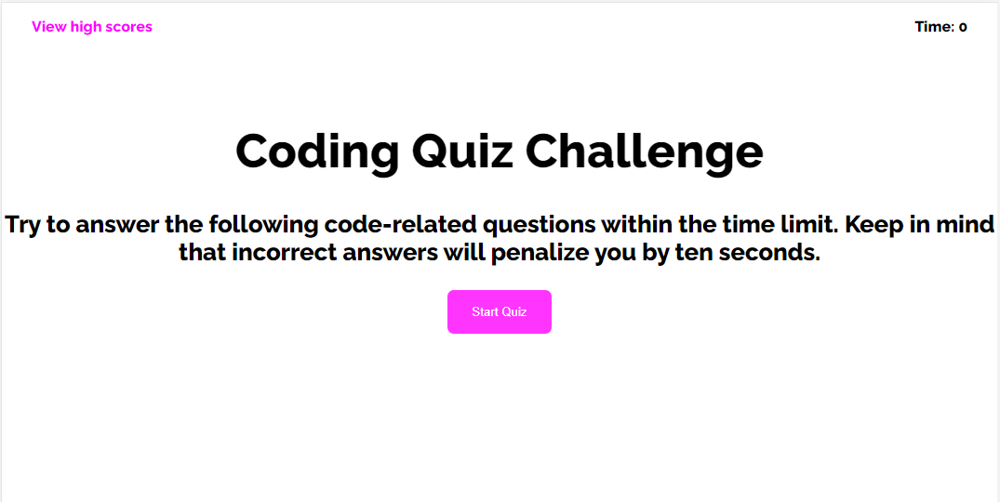
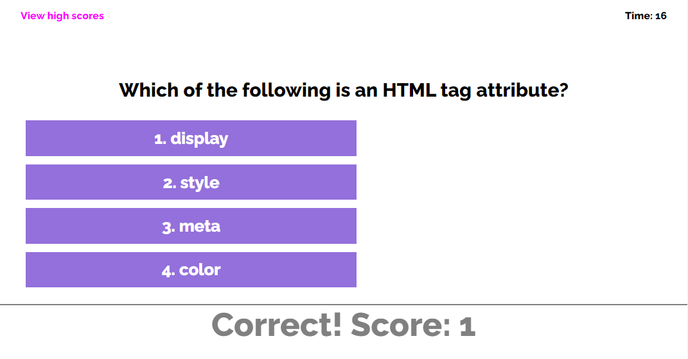
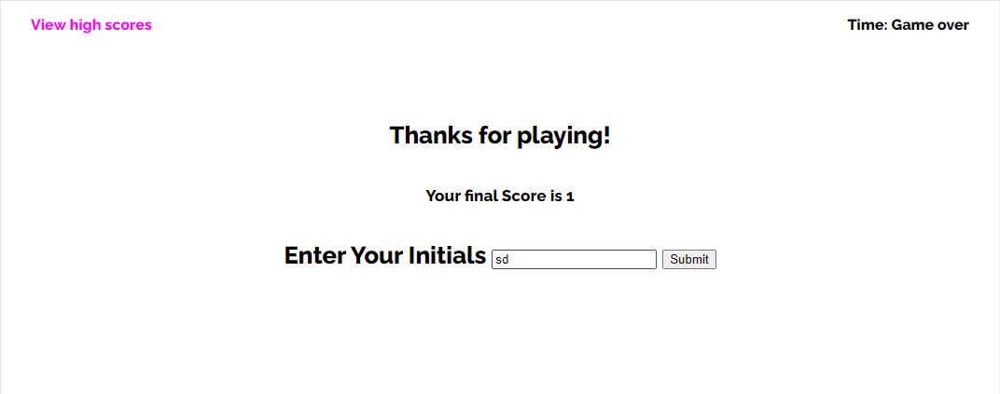

# Javascript-Quiz-App

### Welcome to the Code Quiz Game

If You haven't played the game already, lets not waste anymore time.

Click the Link and Play the Code quiz game for free.
[Coding Quiz Challenge!](https://dorvilsteven.github.io/javascript-quiz-app/)

## Developer Notes

The project was built using vanilla javascript (no frameworks). The main structure of the page that you see if built using html and css for styling, but alot of the content you see on the page that gets updated dynamically are done with javascript.

### Question Display and Basic LSogic

The questions you see are questions stored in an array of objects. the objects store 3 values, a question string, a choices array, and a number that represents the correct answer. That number corresponds to the choices array. when the game is first ran after you click the start button, th question and choices are diplayed using a function. In that function we use simple web APIs to display these questions. A loop is ised to display the choices, but because we dont want multiple questions to be dislayed at once, we only pass one question to the main start game function ata time and we also dont create and append elements here. Instead we use that skeleton we created in HTML and just updated the content with the questions and answer choices.

Some simple logic is used to alert the user if the answer they selected is right or wrong. We must place an `.onclick` property on the list, so when it is clicked, some code is ran. The code that is ran is simple, first we capture the event target, and then we want to see that targets data attribute and if the number we gave it matches answer, and we have to do a simple type conversion her to turn the attribute string to a number. If the event target's data attribute and answer matches then we update score and display to the user that information. If not, then we update by penalizing the amount of time the user has, and we let the user know the choice is wrong. Regardless of rightor wrong, after a choice is made, we move on to the next question.

### Timer

When the game starts, the user is being timed so inside of the main game logic, there is a interval being ran that displays the time to the user and every second the timer drops by 1, due to many bugs the solution i have come up with to prevent a new interval from being called everytime we run the main startgame function is right before we recursively call startgame, we clear the time interval, and when we call start game we are passing in a new time, so when the interval runs again it has the updated time even when the user answers incorrectly and suffers the 10 second penalty.

The last bit of the actual game logic is set to end the game if either of the following two conditions are true, if either time ran out or the user has answered all the questions, all we want to do at that point is stop the timer interval, update the score to the end result screen, hide the quiz screen and then display the end result screen, that will allow the user to see their score and even add it to local storage to save it if they are proud of it.

### Local Storage

If the user enters their initials, and submits the form, their initials and score will be updated into local storage and they will beable to see their score on the high score screen and they are able to clear the high scores, if there are too many or maybe they want the top spot.

All links work and no errors are shown currently.

And don't forget to read carfully, some of the questions are tricky.
[Coding Quiz Challenge!](https://dorvilsteven.github.io/javascript-quiz-app/)
